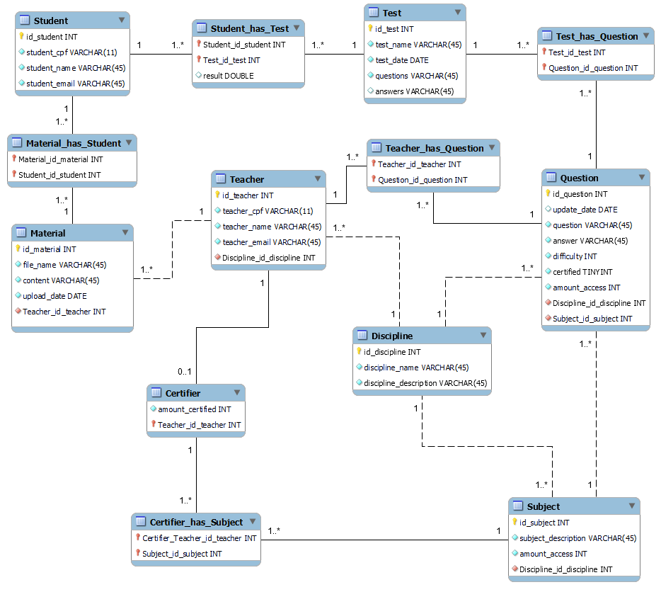

## Sistema de banco de questões

- [Sistema de banco de questões](#sistema-de-banco-de-questões)
- [Descrição da narrativa](#descrição-da-narrativa)
  - [Requisitos gerais do projeto](#requisitos-gerais-do-projeto)
  - [Requisitos específicos do projeto](#requisitos-específicos-do-projeto)
- [Diagramas](#diagramas)
  - [Diagrama de classe](#diagrama-de-classe)
  - [Diagrama ER](#diagrama-er)
- [Instruções para compilar e executar o projeto](#instruções-para-compilar-e-executar-o-projeto)
  - [Conexão com o banco de dados](#conexão-com-o-banco-de-dados)
  - [Compilar e executar o projeto](#compilar-e-executar-o-projeto)
  - [Instruções para visualizar, filtrar, selecionar e gerar provas](#instruções-para-visualizar-filtrar-selecionar-e-gerar-provas)

## Descrição da narrativa

O Banco de questões deve permitir visualizar, filtrar, selecionar, e gerar provas com as questões classificadas das principais matérias e atualizadas constantemente. Nele, os atores Alunos, professores e certificadores (um tipo específico de professor) constroem, avaliam e testam materiais e questões.

O sistema é dividido em quatro partes, todas independentes entre si, e que permitam a interação entre professores e alunos. O primeiro módulo gerencia e armazena questões. As questões armazenadas não ficam disponíveis de imediato para compor as provas. É necessário que passem por uma moderação por certificadores (professores que no seu perfil estejam alinhados com o assunto da questão) para que as mesmas possam compor as provas no sistema. O segundo módulo elabora as provas com base em parâmetros indicados pelo aluno, de forma aleatória (questões e itens) e armazena a estrutura da prova com a sua respectiva pontuação. Observe que este segundo módulo somente monta a prova. O terceiro módulo é o de aplicação de provas propriamente dito. E o último módulo é um módulo de estatísticas e desempenho de aluno que também indica materiais da curadoria para consumo.

Ademais, o primeiro módulo, o de armazenamento de questões, também é responsável por ter funções de busca com bases nos filtros das questões.


### Requisitos gerais do projeto

- [ ] Precisa ter uma página inicial institucional estática, a página inicial;
- [ ] Demais páginas precisam ser dinâmicas e abordar os casos de uso;
- [ ] Ser responsivo, ter pontos de quebra para celular e Desktop;
- [ ] Identidade visual com palheta de cores (até 05) e fontes;
- [ ] Possuir controle de acesso de usuários;
- [ ] Ter entre 05 e 10 componentes distintos do Bootstrap. Entende-se como componentes tudo da seção Components;
- [ ] Diagrama Entidade-Relacionamento do banco de dados;
- [ ] O sistema precisa ter autenticação de usuários.

### Requisitos específicos do projeto

- [ ] Fazer cadastro de aluno, professores e certificadores;
- [ ] Professores cadastram questões de escolha única, múltipla escolha;
- [ ] Professores podem cadastrar material de estudo (PDFs);
- [ ] Professores podem enviar para certificação questões e materiais de estudo;
- [ ] Alunos podem baixar material de estudo;
- [ ] Alunos podem responder provas geradas com base nos assuntos de interesse;
- [ ] Alunos podem acessar seu desempenho;
- [ ] Certificadores podem aprovar ou desaprovar questões e materiais de estudo;
- [ ] É possível classificar as questões e materiais por categorias (tags) e fazer busca dos mesmos no sistema;
Mostrar materiais e assuntos mais acessados.

## Diagramas

### Diagrama de classe

A modelagem inicial das classes do projeto está representado no diagrama de classe UML abaixo.


### Diagrama ER

O diagrama ER abaixo é a proposta inicial para o diagrama entidade-relacionamento do projeto.



## Instruções para compilar e executar o projeto

### Conexão com o banco de dados

<!-- % FIXME[Renan] Ajustar depois -->

Subir o Oracle *database* utilizando Docker [images](https://hub.docker.com/r/gvenzl/oracle-xe)

```
docker run -d -p 1521:1521 -e ORACLE_PASSWORD=<password> -v <pwd>:/opt/oracle/oradata gvenzl/oracle-xe
```

Após a primeira inicialização, é recomendado *resetar* o *password* do usuário `SYS` e `SYSTEM` conforme passo abaixo
```
docker exec <container ID> resetPassword <password>
```

Com o container em execução, é recomendado utilizar a ferramenta de gerenciamento de banco de dados [Oracle SQL Developer](https://www.oracle.com/database/sqldeveloper/) para acessar a *database* instanciada com o Docker.

Ao ter acesso a ferramanta, é possível utilizar o *script DDL* disponível [aqui](mydb/scrip-oracle.sql) para criar as tebelas no banco de dados. 

> No diretório `mydb`, também existe um script para gerar as tabelas em um banco de dados MySQL

### Compilar e executar o projeto

### Instruções para visualizar, filtrar, selecionar e gerar provas 


